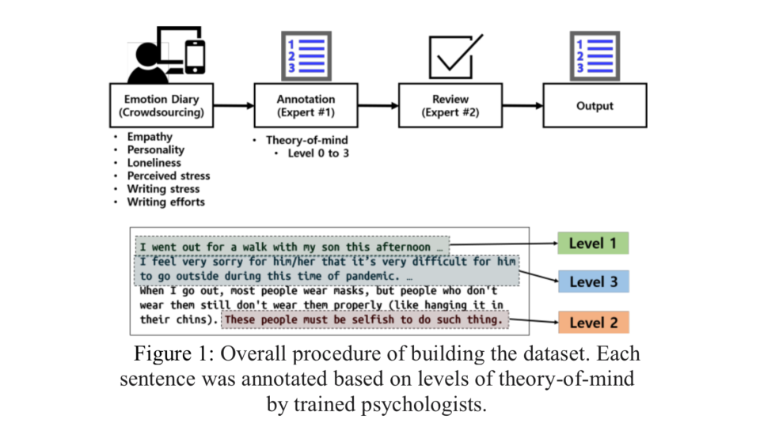
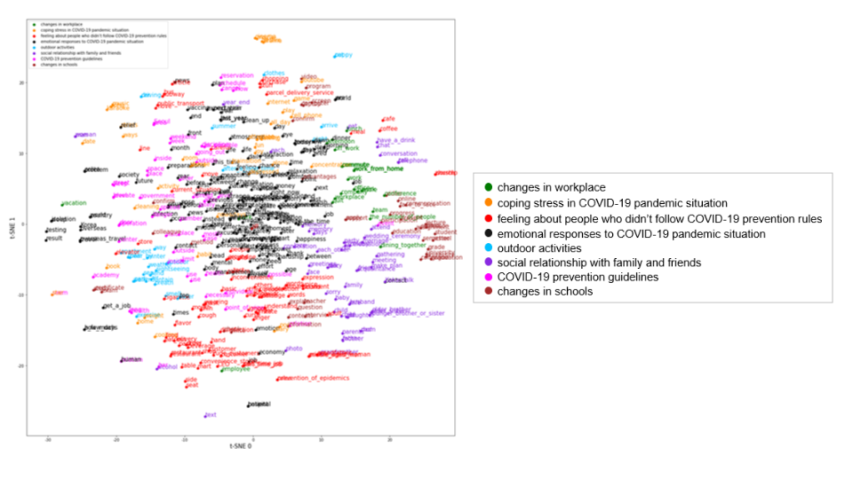
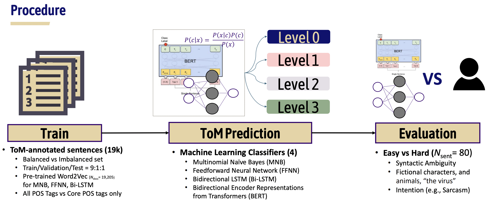
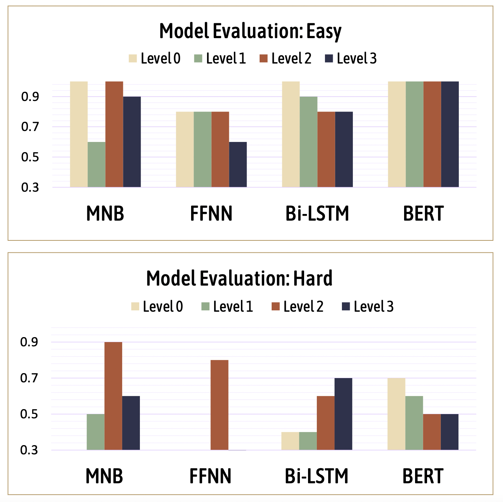

## Korean COVID-Emotion Diary Project: Computational Approach to Measure Empathy and Theory-of-Mind from Written Texts

<br>

### Team
- [Yoon Kyung Lee]((https://yoonkyunglee.oopy.io))<sup>1*</sup>(Cognitive Psychology PhD Cand. @ Seoul National University)
- [Yoonwon Jung](http://hfpsych.snu.ac.kr/Portfolio/portfolio_YoonwonJung.html) <sup>1</sup> 
- [Inju Lee](http://hfpsych.snu.ac.kr/Portfolio/portfolio_InjuLee.html) <sup>1</sup>
- [Jae Eun Park](http://hfpsych.snu.ac.kr/Portfolio/portfolio_JaeEunPark.html) <sup>1</sup> 
- Jiwon Kim <sup>2</sup>
- [Sowon Hahn, Ph.D](http://hfpsych.snu.ac.kr/People.html) <sup>1**</sup> 

<sup>1</sup>
[Human Factors Psychology Lab](https://hfpsych.snu.ac.kr) 
@ [Department of Psychology](https://psych.snu.ac.kr), Seoul National University, Seoul, Korea

<sup>2</sup>
Academic Counseling Center @ ChungNam National University, Daejeon, Korea

- Correspondence: yoonlee78@snu.ac.kr*, swhahn@snu.ac.kr**


<br>

# 1. COVID Emotion Diary (Lee et al., 2021a)

**More information available in our paper >> [(Lee et al., 2021a)](https://escholarship.org/uc/item/950900w7#main)**

## 1.1. Collection 

<p align="center">



   
|  Name |     Survey Response (Item #s)     |
|:--------:|:---------------:|
| Empathy | 0 to 4 (9 items) |
| Theory-of-Mind | Level 0 to 3 |
| Loneliness | 0 to 3 (6 items) |
| Perceived Stress | 0 to 4 (4 items) |
| Personality | 0 to 4 (12 items) |
| Emotions | Happy,fear,disgust,surprise,calm,anger,sad,and *_others_ |
| Gender | Male, Female |
| Age | Numbers |
| Income Level | 1: less than 20k ~ 9: 90k -100k |
| Education Level | 1: middle school ~ 7: others |
| Remote Work | Yes or No |
| Social Distancing | Yes or No |
| Writing Stress | 0 to 4 (1 item) |
| Writing Efforts | 0 to 4 (1 item) |   
  
</p>

*_others_: participants reported (in words) that best represent felt emotions while writing the diary.


### 1.2. Topic Clustering


<p align="center">
    

</p>


### 1.3. Data Request (beta)

### 1.3.1. Specification

|  Dataset |     License     |                  Domain                  |                                    Characteristics                                   |                           Volume<br>(Train / Dev / Test)                           | Tokens<br>(ko / en) | Speakers<br>(Total) |
|:--------:|:---------------:|:----------------------------------------:|:------------------------------------------------------------------------------------:|:----------------------------------------------------------------------------------:|:-------------------:|:-------------------:|
| Covid-ED | CC-BY-NC-SA 4.0 |           Diary<br>(monologue)           |             Sentences are in<br>document level;<br> age, gender, emotion labels included             |                      32,284 utterances<br>(31,324 / 333 / 627)                     |     358K / 571K     |          71         |


- Request 'COVID-ED' in this [link](https://docs.google.com/forms/d/1UTpOrKIWK9uzngh7eIm-3oAp5b5vTdBj4ZapHj8cyBI/viewform?edit_requested=true])
- This version contains is co-managed by [KosPe](https://github.com/warnikchow/kosp2e/blob/main/README.md)


### 1.3.2. Data Example

```
Worker_ID, Age, Gender, Doc#, Sen#, Document
user01,		51, female, 	1,	1, 코로나 이후 회사에서 하루 3번 체온과 건강 상태를 보고 하고 있다.
					   			2, 회사 사이트에 기록도 해야 하는데 미처 기록하지 않으면 상사에게 훈계를 듣는다.
					   			3, 옆 동료와는 대화를 거의 하지 않는다.
					   			4, 식사도 자리에서 혼자 먹는다.
					   			5, 회사에서 수다 떨고 같이 식사하는 즐거움이 요즘은 거의 없다.
							3	1, 시골에 부모님이 계신데 코로나로 인해 올해 한 번도 가질 못했다.
								2, 다른 사람들을 이동을 하는데 나는 아직 조심스럽고 걱정이 돼서 가질 못하고 있다.
								3, 전화통화는 자주 하는 편이지만 연세가 많으셔서 더 자주 가야겠다고 생각하고 있었는데 코로나로 인해 가질 못하고 있다.
								4, 부모님은 뉴스에서 서울에 발생수 증가라는 뉴스가 나오면 걱정을 많이 하신다.
								5, 돌아다니지 말고 마스크 단단히 하고 다니라고 전화를 몇 번씩 하신다.
							4	1, 퇴근길에 보면 동네 술집에 마스크도 쓰지않고 사람들이 인접거리에서 떠들면서 술을 마시는모습을 자주 보고있다.
								2, 혹시라도 잘못되면 어떻게 할건지 집에 가족들은 걱정이 안돼는지 보면서 두렵고 화가난다.
								3, 술자리에서 서로 침을 튀겨가면 열심히 떠들고 나올때 마스크를 다시 한다.
								4, 정말 아이러니다.

```

### 1.4. License

License: CC-BY-NC-SA 4.0. For Research purpose only.

### 1.5. Citation

1) APA

Lee, Y., Jung, Y., Lee, I., Park, J., & Hahn, S. (2021). Building a Psychological Ground Truth Dataset with Empathy and Theory-of-Mind During the COVID-19 Pandemic. _Proceedings of the Annual Meeting of the Cognitive Science Society, 43._ Retrieved from https://escholarship.org/uc/item/950900w7

2) BibTex

```
@inproceedings{lee2021building,
  title={Building a Psychological Ground Truth Dataset with Empathy and Theory-of-Mind During the COVID-19 Pandemic},
  author={Lee, Yoon Kyung and Jung, Yoonwon and Lee, Inju and Park, Jae Eun and Hahn, Sowon},
  booktitle={Proceedings of the Annual Meeting of the Cognitive Science Society},
  volume={43},
  number={43},
  year={2021}
}
```

----

# 2. ToM-BERT: BERT fine-tuned with ToM & Empathy (Lee et al., 2021b )

**More information available in our paper >> [(Lee et al., 2021b)](https://arxiv.org/pdf/2108.11810.pdf)**


## 2.1. Collection

|  Dataset |     License     |                  Domain                  |                                    Characteristics                                   |                           Volume<br>(Train_balanced / Dev / Test for all 4 ToM levels) |
|:--------:|:---------------:|:----------------------------------------:|:------------------------------------------------------------------------------------:|:----------------------------------------------------------------------------------:|
| ToM-Diary | CC-BY-NC-SA 4.0 |           Diary<br>(monologue)           |             Sentences are in<br>document level;<br> ToM levels labelled             |                     12,124 utterances<br>(9,700 / 1,212 / 1,212).                  | 


Among a total of 74,014 sentences, level 0 were 23,874 (32.26%), level 1 were 43,770 (59.14%), level 2 were 3,339 (4.51%), and level 3 were 3,031 (4.1%).

<br>

- Each document (diary) is labeled with four levels of ToM: level 0, 1, 2, 3. Each annotated sentence was then reviewed by psychology experts (graduate students and counseling practitioner)

	- Level 0 : no mention of other's presense.
	- Level 1 : mentions others' behaviors only.
	- Level 2 : mentions other's mental state but refuse or fail to take perspective of them.
	- Level 3 : mentions other's mental state and take perspective of them.


## 2.2. Model Validation



- We performed random under-sampling based on the length of sentence. For each level, we grouped the sentences by length. Above 68% of sentences in level 0 and in level 1, and above 50% of level 2 and 3 had less than 50 (Korean) letters. 
We randomly selected the same number of sentences as level 3 in each length group. As a result, there were 3,031 sentences in each level with a total of 12,124 sentences. 

|  Model Name |Precision  |  Recall  | F1 Score |  Level0_Acc  | Level1_Acc |Level2_Acc |Level3_Acc |
|:----:|:-----:|:-----:|:------:|:-----:|:-------:|:------:|:------:|
| Multinomial Naive Bayes| 0.64 | 0.64 | 0.64 | 0.63 |0.52 |**0.83**|0.55|
| FFNN| 0.56 | 0.56 | 0.56 | 0.72 |0.47 |0.64|0.42|
| Bi-LSTM | 0.73 | 0.73 | 0.73 | 0.85 |0.59 |0.75|**0.73**|
| BERT(multi-ling-base) | **0.78** | **0.78** | **0.78** | **0.89** |**0.76** |0.75|0.72|


## 2.3. Model Inference




- Easy-level Test Sentences


|  Model Name |Level0_Acc| Level1_Acc |Level2_Acc |Level3_Acc |
|:----:|:-----:|:-------:|:------:|:------:|
| Multinomial Naive Bayes| 1.0 | 0.6 | 1.0 | 0.9 | 
| FFNN| 0.8 | 0.8 | 0.8 | 0.6 |
| Bi-LSTM | 1.0 | 0.9 | 0.8 | 0.8|
| BERT(multi-ling-base) | **1.0**| **1.0**|**1.0**|**1.0**|


- Hard-level Test Sentences

|  Model Name |Level0_Acc| Level1_Acc |Level2_Acc |Level3_Acc |
|:----:|:-----:|:-------:|:------:|:------:|
| Multinomial Naive Bayes| 0.3 | 0.5 | **0.9** | 0.6 | 
| FFNN| 0.3 | 0.3 | 0.8 | 0.1 |
| Bi-LSTM | 0.4  | 0.4 | 0.6 | **0.7**|
| BERT(multi-ling-base) | **0.7**| **0.6**| 0.5|0.5|


## 2.4. Evaluation Sentences 

- Sentences made for model inference is at ```/data```. <br>

```
sent : sentence 
tom level: Theory of Mind level annotated to each sentence. 

	----

sent,tom_level
무작정 회화 학원에 나가 말하는 연습을 하기 시작한 게 벌써 3개월이나 지났다.,0
며칠 전 친구들과 배달을 시키면서 처음 먹어보는 메뉴를 골랐는데 생각보다 맛이 없었다. ,1
마스크를 안 썼으면 몸을 사리기라도 해야 하는데 꼭 그런 사람들이 지하철에서 진상 짓을 하고 본인이 진상인지도 몰라서 너무 짜증난다. ,2
휴학하고 나는 밖에는 자주 나가지 못하지만 집에서 쉬어 좋았는데, 비대면 수업을 듣는 다른 친구들은 평소보다 더한 과제 양에 지친 듯하였다. ,3
```

<br>


### Citation

1) APA

Lee, Y. K., Lee, I., Park, J. E., Jung, Y., Kim, J., & Hahn, S. (2021). A Computational Approach to Measure Empathy and Theory-of-Mind from Written Texts. _arXiv preprint arXiv:2108.11810_.


2) BibTex

```
@article{lee2021computational,
  title={A Computational Approach to Measure Empathy and Theory-of-Mind from Written Texts},
  author={Lee, Yoon Kyung and Lee, Inju and Park, Jae Eun and Jung, Yoonwon and Kim, Jiwon and Hahn, Sowon},
  journal={arXiv preprint arXiv:2108.11810},
  year={2021}
}
```

## Contact
### [Yoon Kyung Lee](yoonkyunglee.oopy.io), yoonlee78@snu.ac.kr

## Acknowledgement

This is part of K-Data Agency (한국데이터진흥원) Data Voucher Project (데이터바우처사업). We thank DeepNatural.AI for helping data collection and processing.
We also thank annotators for their help. 

